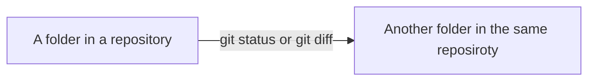

# git locommit (.commit folder)

( [Japanese](./README-jp.md) )

## Overview

The `locommit` command is the equivalent of `git status` and `git diff`
that can be used outside the Git working directory
(the folder containing the .git folder)
or in subfolders of the Git working directory.


or




## Behavior

First, `locommit` command copies the files in the current folder
and its subfolders to the `.commit` folder directly under the current folder.
At this time, files specified in `.gitignore` are not copied.
This `.commit` folder is as the comparison target of `git status` and `git diff`.

```mermaid
graph LR;
    s[ Current folder ];
    d[ .commit folder ];
    s -. Copy using .gitignore .-> d;
```

Next, if the `.commit` folder exists directly under the current folder,
the files in the current folder and its subfolders are copied to
the `.commit_new` folder directly under the current folder.
And immediately lists file names that differ from the `.commit` folder.
This behavior corresponds to `git status` and `git diff`.

```mermaid
flowchart TD;
    s[ Current folder ];
    subgraph &nbsp;
        c[ .commit folder ];
        d[ .commit_new folder ];
    end
    s -. Copy using .gitignore .-> d;
    c <-- Compare --> d;
```


## Environment

- Windows (bash)
- mac
- Linux


## Install

- It requires Git installed to work.
    Make sure you can use git commands from bash or zsh.
- Copy the `locommit` file in `bin` folder
    to a folder in your bash path.


## Usage

### locommit command

`locommit` command of copying using .gitignore
takes no parameters.
The movement changes depending on the situation.

The `.gitignore` file should write
to the `.commit` and `.commit_*`.

Sample `.gitignore`:

    .commit
    .commit_*

### Case of no `.commit` folder

If there is no `.commit` folder directly under the current folder,
copies the files in the current folder and its subfolders
to the `.commit` folder directly under the current folder.
At this time, files specified in `.gitignore` are not copied.
This `.commit` folder is the comparison target of `git status` and `git diff`.

- Unstaged changes in git also copy into the `.commit` folder
- Files in `.commit` folders are turned on read-only attribute
- Running the `locommit` command outside of Git working folder, also creates a `.git` folder.
    `locommit push` and `locommit pull` commands will not work without the `.git` folder
- Running the `locommit` command in a subfolder of Git working folder will not create
    a `.git` folder, but the `locommit push` and `locommit pull` commands will work
- The `.commit` folder is specified in `.gitignore`,
    so even if you add a commit or change the branch,
    the contents corresponding to the comparison target of
    `git status` or `git diff` will not change.

Sample commands:

    $ cd __WorkingDirectory__
    $ locommit
    Added .git folder and first commit.
    Created new ".commit" folder.
    This will be treated as base commit.
    $ ls .commit
    .gitignore
    package.json

### Case that `.commit` folder is already exists

If there is already a `.commit` folder directly under the current folder,
copies the files in the current folder and its subfolders
to the `.commit_new` folder directly under the current folder.
At this time, files specified in `.gitignore` are not copied.
And immediately lists filenames that differ from the `.commit` folder.
This behavior corresponds to `git status` and `git diff`.

- The output for different files is the same as the `diff -qr` command
- Unstaged changes in git commands to the parent `.git` folder
    are also copied into `.commit_new` folder
- Files in `.commit_new` folders are turned on read-only attribute

Sample commands:

    $ cd __WorkingDirectory__
    $ locommit
    Created new ".commit_new" folder.
    Changes for .commit:
        Files .commit/package.json and .commit_new/package.json differ
        Only in .commit_new: tsconfig.json
    $ ls .commit
    .gitignore
    package.json
    $ ls .commit_new
    .gitignore
    package.json
    tsconfig.json

If the contents of the `.commit` folder and the contents of
the `.commit_new` folder are the same,
the `.commit_new` folder will be deleted immediately.

    $ cd __WorkingDirectory__
    $ locommit
    Deleted ".commit_new" folder.
    SAME as ".commit" folder.


## --no-git option

Running the `locommit` command in the folder with the `.git` folder
will result in an error, but with the `--no-git` option it will not.

- Unstaged changes in git also go into `.commit` folder
- Files in `.commit` folders are not turned on read-only attribute
- You can move created `.commit` folder to any folder
- `locommit --no-git` command does not change the contents in `.git` folder
- `locommit push` and `locommit pull` commands cannot be used in the folder
    where `locommit --no-git` command was executed

Sample commands:

    $ cd __WorkingDirectory__
    $ locommit --no-git
    Created new ".commit" folder.
    $ ls .commit
    .gitignore
    package.json


## clone command


The clone command copies files from existing folder
except excluded files by the `.gitignore` file just under an existing folder
and creates `.commit` and `.git` folders.
It is not necesary to take care that existing folders and new folders are
inside or outside Git working directory.

    locommit clone __OriginalFolder__ __NewWorkingFolder__

Sample commands:

    $ locommit clone "OriginalFolder" "NewWorkingFolder"
    Created new ".commit" folder.


## pull command


The pull command merges the repository folder contents into the current folder.

    cd __WorkingDirectory__
    locommit pull __RepositoryFolderPath__

The pull command merges the contents of
`__RepositoryFolderPath__` folder into the current folder.

    $ cd __WorkingDirectory__
    $ locommit pull _repository
    Created ".commit_repository" folder
    Renamed ".commit_new" folder to ".commit_before_pull" folder
    Pull from ".commit_repository" folder
    Auto-merging example.txt
    Merge made by the 'ort' strategy.
    example.txt | 2 +-
    1 file changed, 1 insertion(+), 1 deletion(-)
        Files .commit/example.txt and .commit_repository/example.txt differ

`.commit_before_pull` folder and `.commit_repository` folder are created,
when the contents of the latest repository folder were changed from
the contents of `.commit` folder.

- `.commit_before_pull` folder: Contents of current folder before pull command
- `.commit_repository` folder: Copy of the latest repository folder

The pull command can have conflicts.

    $ cd __WorkingDirectory__
    $ locommit pull _repository
    Created ".commit_repository" folder
    Renamed ".commit_new" folder to ".commit_before_pull" folder
    Pull from ".commit_repository" folder
    Auto-merging example.txt
    CONFLICT (content): Merge conflict in example.txt
    Automatic merge failed; fix conflicts and then commit the result.
        Files .commit/example.txt and .commit_repository/example.txt differ

The locommit command will show CONFLICT(s) warning
until conflicts are resolved.

    $ cd __WorkingDirectory__
    $ locommit
    Created new ".commit_new" folder.
    Changes for .commit:
        Files .commit/example.txt and .commit_new/example.txt differ
    CONFLICT:
        ./example.txt:3: <<<<<<< HEAD

If conflicts were resolved, use the push command.
The push command will also delete `.commit_before_pull` folder
and `.commit_repository` folder in addition to the normal push command behavior.

Files in the repository folder specified in the pull command
that are marked with `.gitignore` will not be merged.


## push command


The push command will overwrite the contents of current folder
into the repository folder.
If **the push command is not executed immediately after the pull command**,
note that any updates to the repository folder
by editing other than the current folder
will be overwritten and lost by push command.

    cd __WorkingDirectory__
    locommit push __RepositoryFolderPath__

Push command copies files in `.commit_new` folder to `__RepositoryFolderPath__`
and turn off the read-only attribute of the file.
Also move files in the `.commit_new` folder into the `.commit` folder
and delete `.commit_new` folder.

Files in the `.commit` folder that are no longer in the `.commit_new` folder
will be deleted in the `__RepositoryFolderPath__` folder.

- Replace `__RepositoryFolderPath__` to the actual folder path
- Files that there are in `__RepositoryFolderPath__` but not in `.commit_new` folder
    is deleted
- `.git` folder directly under `__RepositoryFolderPath__` is not changed

Specifying `__RepositoryFolderPath__` as `/dev/null` will copy no file and
move files in the `.commit_new` folder into the `.commit` folder
and delete `.commit_new` folder.
